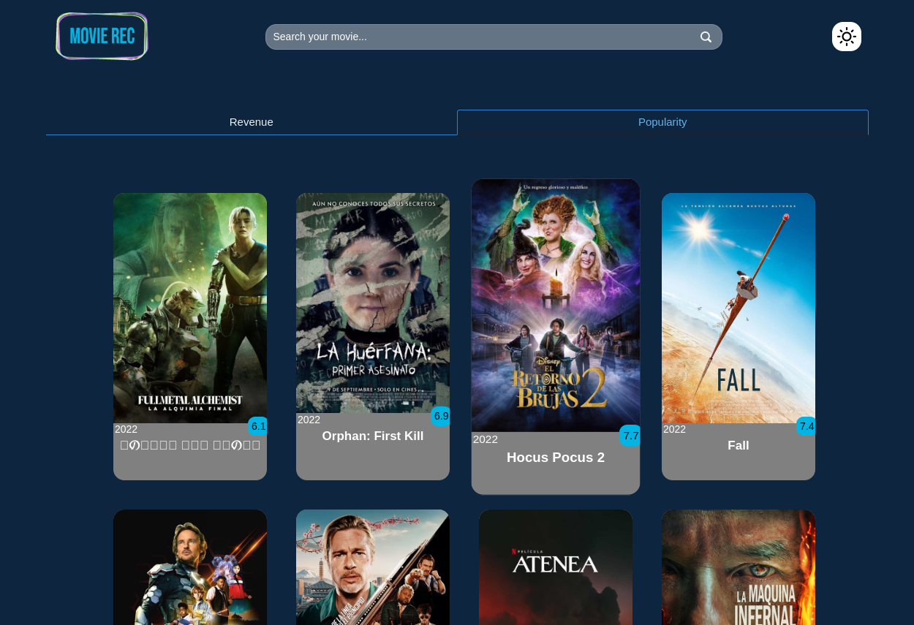
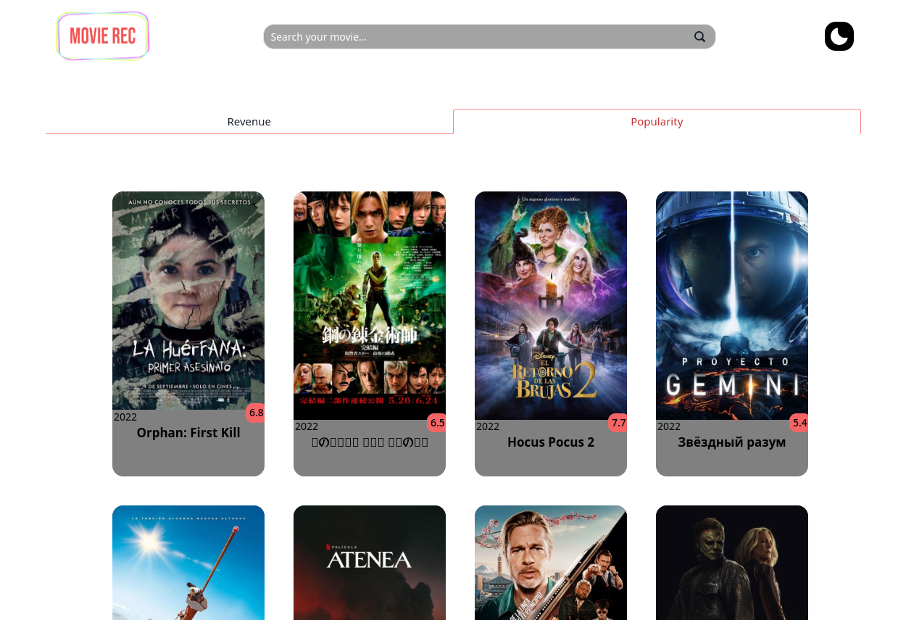
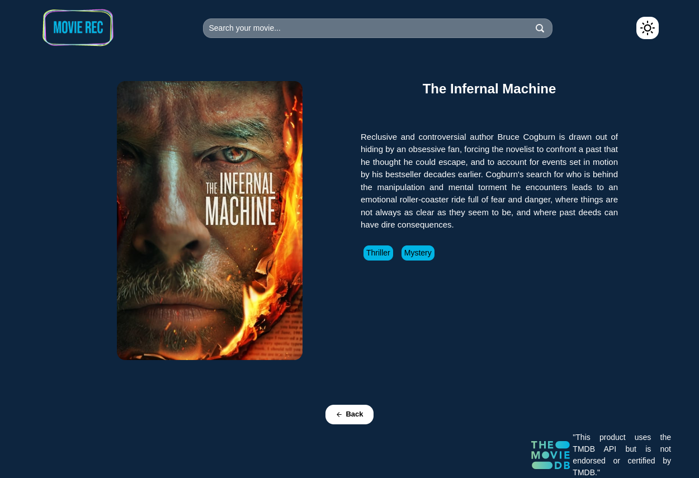

# Movie Rec

Proyecto Personal de peliculas utilizando la API de [The Movie Data Base](https://www.themoviedb.org/)

## Overview

#### Descripción de la página

Página con home inicial en donde aparecen dos pestañas, tiene un buscador y un toggle para cambiar el color del tema

### Screenshot

### Links

- Live Site URL: [Movie Rec](https://movie-rec.vercel.app/)

## My process

### Built with

- Semantic HTML5 markup
- CSS custom properties
- Flexbox
- CSS Grid
- Mobile-first workflow
- [React](https://reactjs.org/) - JS library
- [React-Router-Dom](https://reactrouter.com/en/main)

## Author

- LinkedIn - [Luis Medina](https://www.linkedin.com/in/luis-medina-dev/)
